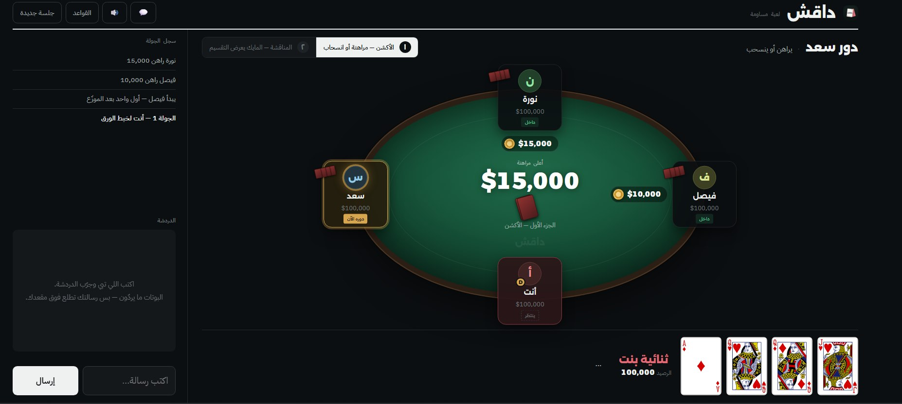
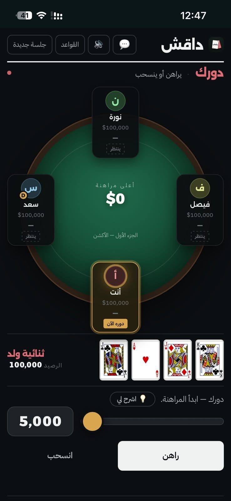

<a name="english"></a>

# Dagesh · داقش

[English](#english) | [العربية](#arabic)

<p align="center">
  
  
</p>

**Play it here:** https://waelsaballyl.github.io/dagesh/

Dagesh is a Gulf card game built around bargaining. Players bet, the highest bettor offers to split the money, and most rounds are settled before a single card is shown. Anyone who believes they hold the best hand can call *dagesh* at any moment and force every card face up.

The whole game is one HTML file with no backend, no database and no sign-up. Friends join a room with a five-digit code from any phone or laptop.

## How a round works

Each player gets four cards. The deck is built for the exact number of players (one rank per player, four suits each), so a four-player game uses only aces, kings, queens and jacks. Every card in your hand rules out combinations for everyone else, and reading that is half the game.

1. **Betting.** One pass around the table. Raise the highest bet by at least 5,000 or fold. If you can't cover it, the only way to stay in is all-in.
2. **The split.** The highest bettor takes the mic and divides their bet among the players still in, in any proportion they like. Each player accepts their share or asks for more. If everyone accepts, the round ends and nobody's cards are revealed.
3. **Dagesh.** During the split, any player still in the round can call dagesh. All hands are revealed, the strongest hand wins the amount it bet, and every other player loses theirs.

Hands, strongest first: four of a kind, a four-card run in one suit (*miya*), three of a kind, two pairs, one pair, high card.

After betting you can only leave with the mic holder's permission, and they are free to refuse. If everyone else folds, the last bettor keeps their full bet. Everyone starts with 100,000 and the first player to reach 1,000,000 wins. If players go broke and only two remain (three when seven or more started), the highest balance wins.

## Ways to play

- **With friends.** Host a room and share the code, or send an invite link like `?room=12345` that drops people straight in. Rooms can stay private or be listed publicly for anyone to join. Up to 13 seats, with spectators and optional bots to fill empty places.
- **Against bots.** Easy, medium or hard. Hard bots bluff and will pay to keep you quiet.
- **Pass the phone.** 4 to 13 players sharing one device, with a privacy screen before each turn.

## Features

- Separate table layouts for phones and laptops, with seats that rearrange themselves for anywhere from 3 to 13 players.
- In-game chat with typing indicators. Messages also pop up above the sender's seat, and the richest player wears a crown.
- The host can step away and another player takes over the room. Anyone who drops out can rejoin the same seat with the same balance.
- Short prompts for experienced players, plus an "اشرح لي" toggle that explains every step for beginners.
- Card and chip foley, a dramatic hit when someone calls dagesh, and fireworks when a player reaches a million.

## Under the hood

- Plain JavaScript in a single `index.html`. The only external library is mqtt.js from cdnjs.
- Online play runs over public MQTT brokers via WebSocket (EMQX first, with HiveMQ and Mosquitto as fallbacks), so there is no server to maintain.
- The host's device deals and referees. Every player receives a copy of the game state that contains only their own cards.
- `bump.py` stamps a build number into the page. Open tabs compare it with the live version and reload themselves when an update ships.

**A note on fairness:** since the host's device deals the cards, it technically holds every hand. Among friends this is no different from whoever is holding the deck, so play with a host you trust.

## Running it

Serve the folder locally and open it in a browser:

```bash
python -m http.server 8000
```

The live site is served by GitHub Pages from the root of `main`. Run `python bump.py` before every push so players get the new version instead of a cached one.

## Credits

Card art is **Vectorized Playing Cards 1.3**, © 2011 Chris Aguilar, under LGPL 3. The site loads it from jsDelivr, falls back to the copy in `cards/`, and draws the card in SVG if both fail.

Sound effects come from **Freesound** (CC0) and **Pixabay** (Pixabay Content License). Each clip was trimmed to a single hit and level-matched with the rest of the set. The full list of sources is in `sfx/CREDITS.txt`.

---

<a name="arabic"></a>

<div dir="rtl">

# داقش

[English](#english) | [العربية](#arabic)

<p align="center">
  
  
</p>

**رابط اللعبة:** https://waelsaballyl.github.io/dagesh/

داقش لعبة ورق خليجية تقوم على المساومة. اللاعبون يراهنون، وصاحب أعلى مراهنة يعرض تقسيم الفلوس على الباقين، وأغلب الجولات تنتهي قبل أن تنكشف ورقة واحدة. ومن يظن أن ورقه هو الأقوى يستطيع أن "يداقش" في أي لحظة، فيقلب الجميع أوراقهم.

اللعبة كلها ملف HTML واحد، بدون خادم ولا قاعدة بيانات ولا تسجيل حساب. يدخل الأصحاب الغرفة برمز من خمسة أرقام، كل واحد من جواله أو لابتوبه.

## كيف تسير الجولة

كل لاعب يأخذ أربع أوراق، والشدّة تُبنى على عدد اللاعبين بالضبط (رقم واحد لكل لاعب بأشكاله الأربعة)، فإذا كنتم أربعة لا يُوزَّع إلا الأكة والشايب والبنت والولد. كل ورقة في يدك تُسقط احتمالات عند غيرك، وقراءة هذا نصف اللعبة.

1. **الأكشن.** دورة واحدة على الطاولة. تزيد على أعلى مراهنة بـ 5,000 على الأقل أو تنسحب، وإذا لم يكفِ رصيدك فلا يبقى أمامك إلا "أول-إن" بكل ما معك.
2. **المناقشة.** صاحب أعلى مراهنة يأخذ المايك ويوزّع مبلغ مراهنته على اللاعبين الباقين بالنسبة التي يريدها. كل لاعب يوافق على حصته أو يطلب أكثر، وإذا وافق الجميع تنتهي الجولة دون أن تنكشف أي ورقة.
3. **الداقش.** في أثناء المناقشة يحق لأي لاعب داخل الجولة أن يداقش. تنكشف كل الأوراق، فيربح صاحب أقوى مشروع مبلغ مراهنته، ويخسر كل واحد من الباقين مبلغ مراهنته هو.

ترتيب المشاريع من الأقوى: رباعية، ثم مية (أربع أوراق متسلسلة من نفس الشكل)، ثم ثلاثية، ثم دبل ثنائية، ثم ثنائية، ثم ورق عادي.

بعد المراهنة لا يخرج اللاعب إلا بإذن صاحب المايك، وله أن يرفض. وإذا انسحب الجميع وبقي مراهن واحد، تصير مراهنته كاملة له. يبدأ كل لاعب بـ 100,000، ويفوز أول من يصل إلى مليون. وإذا أفلس بعض اللاعبين ولم يبقَ إلا اثنان (أو ثلاثة إذا بدأتم سبعة فأكثر)، يفوز الأعلى رصيدًا.

## طرق اللعب

- **مع الأصحاب.** تنشئ غرفة وترسل الرمز، أو ترسل رابط دعوة مثل `?room=12345` يُدخلهم مباشرة. الغرفة تبقى خاصة أو تظهر في قائمة الغرف المفتوحة لمن يريد الانضمام. تتسع حتى 13 لاعبًا، مع متفرجين وبوتات اختيارية لملء المقاعد الفارغة.
- **ضد البوتات.** ثلاثة مستويات: سهل ومتوسط وصعب. البوت الصعب يبلف ويدفع لك لتسكت.
- **مرّر الجوال.** من 4 إلى 13 لاعبًا على جهاز واحد، مع شاشة حجب قبل كل دور.

## أبرز المزايا

- تصميم طاولة خاص بالجوال وآخر باللابتوب، والمقاعد تترتب تلقائيًا لأي عدد من 3 إلى 13 لاعبًا.
- دردشة داخل اللعبة مع مؤشر الكتابة، والرسالة تظهر أيضًا فوق مقعد صاحبها، والأعلى رصيدًا يظهر عليه تاج.
- يستطيع المضيف أن يخرج فيستلم لاعب آخر الاستضافة، ومن ينقطع يرجع لنفس مقعده ونفس رصيده.
- رسائل مختصرة لمن يعرف اللعبة، وزر "اشرح لي" يشرح كل خطوة للمبتدئين.
- أصوات ورق وفيش حقيقية، وضربة درامية عند الداقش، وألعاب نارية لمن يصل إلى المليون.

## كيف بُنيت

- JavaScript خالص في ملف `index.html` واحد، والمكتبة الخارجية الوحيدة هي mqtt.js من cdnjs.
- اللعب أونلاين يمر عبر وسطاء MQTT عامة بـ WebSocket (EMQX أولًا، ثم HiveMQ وMosquitto احتياطًا)، فلا يوجد خادم يحتاج إلى صيانة.
- جهاز المضيف هو الذي يوزّع الورق ويحكم الجولة، وكل لاعب تصله نسخة من حالة اللعبة لا تحتوي إلا أوراقه هو.
- `bump.py` يكتب رقم النسخة داخل الصفحة، والصفحات المفتوحة تقارنه بالنسخة المنشورة وتحدّث نفسها عند نزول أي تحديث.

**ملاحظة أمانة:** بما أن جهاز المضيف هو الذي يوزّع الورق، فهو تقنيًا يملك كل الأوراق. بين الأصحاب هذا مثل من يمسك الشدّة في الواقع، لذلك اختاروا مضيفًا تثقون فيه.

## التشغيل

شغّل المجلد محليًا وافتحه في المتصفح:

```bash
python -m http.server 8000
```

الموقع منشور على GitHub Pages من جذر فرع `main`. شغّل `python bump.py` قبل كل رفع حتى تصل النسخة الجديدة للاعبين بدل النسخة المحفوظة في المتصفح.

## المصادر

رسوم الأوراق من **Vectorized Playing Cards 1.3**، حقوق 2011 Chris Aguilar، برخصة LGPL 3. الموقع يحمّلها من jsDelivr، ويرجع للنسخة المحلية في `cards/` إذا تعذّر ذلك، ويرسم الورقة بـ SVG إذا فشل الاثنان.

المؤثرات الصوتية من **Freesound** برخصة CC0، ومن **Pixabay** برخصة Pixabay Content License. كل مقطع قُصّ إلى ضربة واحدة ووُحّد مستواه مع بقية الأصوات، والقائمة الكاملة في `sfx/CREDITS.txt`.

</div>
